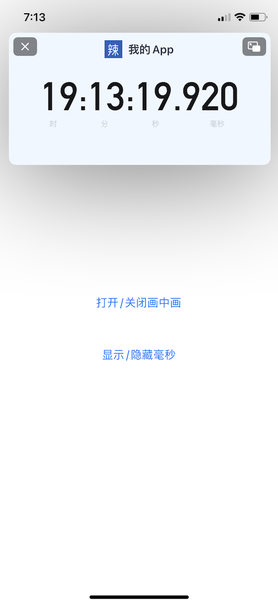

**[English Document](README_EN.md)**

---

基于 iOS 14 的 `AVPictureInPictureController`，完全自定义画中画，已覆盖市面上所有画中画的核心和难点。

**iOS Android Flutter 全部平台，全部代码，全部开源！！！**

> **更多功能持续更新中，欢迎star！**


**iOS demo 运行环境：**

真机 & iOS14或以上


**demo 展示：**

1. 悬浮提词器：


2. 悬浮秒表：



---


## 难点和思路：

*因为 Android 的自定义画中画无任何难度，所以此处只讨论 iOS 的自定义画中画。*

### 1. 如何添加自定义 view 到画中画窗口？

你如果在画中画弹出前后将所有 window 打印出来，你就会发现，当画中画弹出后，多了一个 window，而这个 window 就是你添加自定义 view 的 window。

### 2. 如何隐藏系统的快进快退按钮、播放按钮、进度条？

`AVPictureInPictureController` 提供的接口就那几个，你尝试了所有接口都实现不了。这个时候就可以断定，这个功能是通过私有 api 来实现的了。

那么如何找到那个私有api？两种方法：

1. 使用 `Runtime` 的 api 打印出所有私有属性；
2. 使用工具： https://developer.limneos.net/index.php?ios=14.4&framework=AVKit.framework&header=AVPictureInPictureController.h

有了私有属性列表，后面就自行尝试了。


### 3. 如何用代码动态修改悬浮窗口的形状？

窗口的形状由视频的形状决定，修改视频源就可以修改窗口形状。

### 4. 如何用代码旋转悬浮窗口？

详见demo源码。


### 5. 如何在录视频时不暗屏？

详见demo源码。


### 6. 如何让画中画在后台一直运行？

播放无声音频。


### 7. 如何进入后台时自动开启画中画？

`AVPictuerInPictureController` 提供了一个属性：


```swift
if #available(iOS 14.2, *) {
    pipController.canStartPictureInPictureAutomaticallyFromInline = true
} else {
    // Fallback on earlier versions
}
```

**注：画中画的 player 必须处于播放状态。**


### 8. 如何监听画中画窗口变大变小？

KVO，监听画中画里view大小的变化；或者直接在 `layoutSubviews` 方法里处理。


### 9. 如何在画中画开启时，让 app 自动进入后台？

调用下面方法：

```swift
UIControl().sendAction(#selector(URLSessionTask.suspend), to: UIApplication.shared, for: nil)
```


### 10. 如何让滚动更加丝滑？

使用 `CADisplayLink`。


### 11. 如何提升悬浮秒表的精度？

使用 GCD Timer。


### 最后，如何应对苹果的审核？

苹果可能会因为你使用了后台权限而拒绝你，这个时候你可以在APP里添加一个系统播放器，就播放画中画的使用教程，有了系统播放器，你就可以理所当然的使用画中画了。

或者用一个web，web里的播放器也会调用系统播放器。

